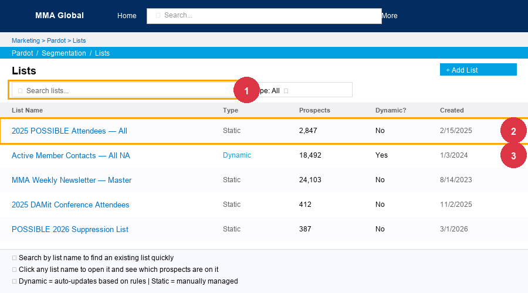

# Pardot Email Operations

MMA uses **Pardot** (now called "Marketing Cloud Account Engagement") for marketing emails. Aaron builds the **lists** that emails are sent to. The actual email sending is handled by **Jason Chase at Reach Marketing**.

**Pardot URL:** https://pi.pardot.com  
**Login:** Same as Salesforce (single sign-on)

**Key people:**
- **Jason Chase** — schedules and sends all Pardot emails; he needs a list name/ID from Aaron
- **Amanda Hyland** — drives what emails go out and when

---

## How it works

1. Aaron builds a **Prospect List** in Pardot with the right contacts
2. Aaron gives Jason the **list name** (or Pardot list URL/ID)
3. Jason creates the email send in Pardot and applies suppression lists automatically
4. Jason fires the send (often coordinated with Amanda)

**Standard suppressions Jason always applies:**
- Board of Directors lists
- Anyone who has already RSVP'd (for event emails)
- Recent responders (for survey emails)

---

## Tasks

### 🟢 EASY: Find an existing Pardot list

1. Go to **Pardot** (https://pi.pardot.com)
2. Click **Lists** in the left nav → **Prospect Lists**
3. Use the search bar to find the list by name
4. Click into the list to see how many prospects are in it and their details

---

### 🟢 EASY: Check if a specific person is in a Pardot list

1. In Pardot, go to **Prospects** → search by email address
2. Open their **Prospect** record
3. Click the **Lists** tab to see every list they are on
4. Also check **Mailable** status — if it shows "Unmailable," see why (usually opted out or bounced)

---

### 🟢 EASY: Check someone's mailable status in Pardot

1. Search for the person in Pardot by email
2. Open their Prospect record
3. Look at the top right — it will say **Mailable** or **Unmailable**
4. Click **View Reasons** to see why they're unmailable (opted out, hard bounce, etc.)

> **Important context:** Even unmailable prospects can still receive emails. Reach Marketing emails unmailable people through their own domain as a workaround. So "unmailable in Pardot" does NOT mean they can never be contacted — just that Pardot itself won't send to them.

---

### 🟡 MEDIUM: Build a Pardot list from a Salesforce report

**When this comes up:** Jason or Amanda needs a specific audience list for an email.

**Option A — Dynamic list (automatically updates):**
1. In Pardot, go to **Lists** → **+ Add List**
2. Name it clearly (e.g., "POSSIBLE 2026 Registered Members - April 2026")
3. Select **Dynamic List**
4. Set rules that match the audience:
   - Salesforce Account Status `contains` Active
   - Region `contains` NA or Global
   - Any other filters needed
5. Save — Pardot will auto-populate it

**Option B — Static list (one-time upload):**
1. Export the list from Salesforce as a CSV (include Email, First Name, Last Name columns)
2. In Pardot, go to **Lists** → **+ Add List** → **Static**
3. Click **Import** → upload the CSV
4. Map columns: Email → Email, etc.
5. Save

> **Tip:** Always check the list count after creation and sanity-check a few names to make sure it looks right before telling Jason it's ready.

---

### 🟡 MEDIUM: Update the suppression list for a Pardot send

**When this comes up:** Jason or Kayte asks you to update a suppression list before a send.

A suppression list works the same as a regular list — you add people to it, and Jason applies it at send time so those people don't receive the email.

**Adding people to a suppression list:**
1. Export the people to suppress as a CSV from SF or the source (e.g., SurveyMonkey for survey completers)
2. In Pardot, find the suppression list by name (Jason can tell you which one)
3. Click **Import** → upload the CSV
4. Pardot will match by email and add them to the list

---

### 🔴 HARD: Bulk importing a webinar attendee list into Pardot

Aaron uses Python to clean and import large attendee files. For coverage, ask Jason Chase if he can do a direct import into Pardot — he has import access as well.

---

### 🔴 HARD: Cleaning duplicate Pardot prospects

Aaron uses a script for this. Do not attempt manually. Flag to Aaron.
