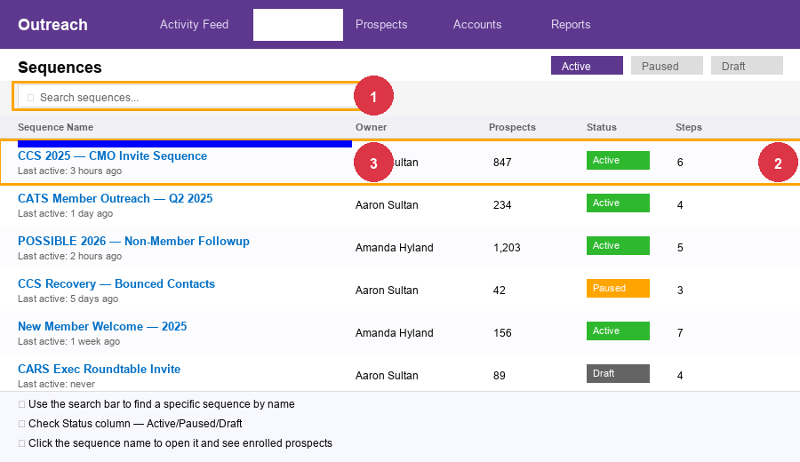

# Outreach Sequence Management

**Outreach** is MMA's sales engagement platform. Aaron uses it to manage email outreach sequences for:
- **POSSIBLE** member invitations
- **CCS (CMO & CEO Summit)** / **CATS** / **CARS** — invitation outreach run by Greg Stuart and Angela
- **DAMit** (Digital Advertising Measurement series) promotion
- **Monthly Roundtable (MR)** login emails

**URL:** https://app.outreach.io  
**Login:** Separate from Salesforce

**Key people:**
- **Amanda Hyland** — drives POSSIBLE/CCS sequence sends
- **Angela Gray** — runs CCS/CATS CMO outreach
- **Greg Stuart** — sends personal CMO emails through Outreach

---

## Important concepts

- A **sequence** is a series of automated emails sent over time to a list of prospects
- Each person in a sequence is called a **prospect**
- Sequences can be **paused** or **active** — don't resume a sequence without checking with Amanda first
- If someone **replies**, Outreach stops sending to them automatically
- If someone **bounces**, they get marked and should be removed from future sequences
- Aaron also **stores assistants (EAs)** in Outreach linked to their executives — so searching a CMO may show their EA too

---

## Tasks

### 🟢 EASY: Check if a specific person is in an Outreach sequence

1. Go to **Outreach** → click **Prospects** in the left nav
2. Search by name or email
3. Click their record → scroll to **Sequences** tab
4. You'll see which sequences they're in and their status (Active, Paused, Finished, Bounced, etc.)

---

### 🟢 EASY: Check a sequence's current status and stats

1. In Outreach, go to **Sequences** in the left nav
2. Search by name or scroll to find it
3. Click into the sequence to see:
   - How many people are in it
   - Open/reply/bounce rates
   - Whether it's currently Active or Paused

---

### 🟢 EASY: Pause a sequence (emergency stop)

1. In Outreach → **Sequences**
2. Find the sequence
3. Click the **Pause** button (top right of the sequence view)
4. Confirm — all emails will stop until resumed

> **When to do this:** If there's a typo in an email, if someone important (like a board member) is accidentally in the sequence, or if Amanda/Angela asks you to pause.

---

### 🟡 MEDIUM: Add one person to an Outreach sequence

**When this comes up:** Andrew Somer asks to add a specific CMO to the CCS/CATS sequence.

1. In Outreach, find the sequence you want to add them to
2. Click **Add Prospects** (or **Enroll**)
3. Search for the person by name or email
4. If they exist in Outreach, select them and confirm enrollment
5. If they don't exist, you'll need to create a Prospect first:
   - Click **Prospects** → **+ New Prospect**
   - Fill in: First Name, Last Name, Email, Title, Company
   - Save, then go back to the sequence and add them

> **Check before adding:** Make sure they're not already in the sequence (search their email first).

---

### 🟡 MEDIUM: Remove someone from an Outreach sequence (they replied / asked to stop)

1. Find the person in **Prospects** → open their record
2. Click the **Sequences** tab
3. Find the active sequence → click **Finish** or **Remove**
4. This stops all further emails to them in that sequence

---

### 🔴 HARD: Bulk-adding a list of people to a sequence

Aaron uses Python (`add_prospects_to_sequence.py`) to bulk-add contacts from Salesforce reports. For coverage:
- For small batches (< 10 people), do it manually using the steps above
- For large batches, hold and wait for Aaron unless Amanda says it's urgent

---

### 🔴 HARD: Investigating a rogue sequence resend / bounce issue

If Outreach is re-sending to people who already bounced or already replied, this requires investigation:
1. Check the sequence settings for any automation rules that might re-trigger
2. Contact Outreach support: https://support.outreach.io
3. Notify Amanda/Angela immediately so they know what's happening

---

### ⚠️ Things to never do in Outreach

- **Don't resume a paused sequence** without checking with Amanda or Angela
- **Don't add board member contacts** to sequences (they're managed separately by Jade/Angela)
- **Don't delete sequence steps** — you'd break the sequence permanently
