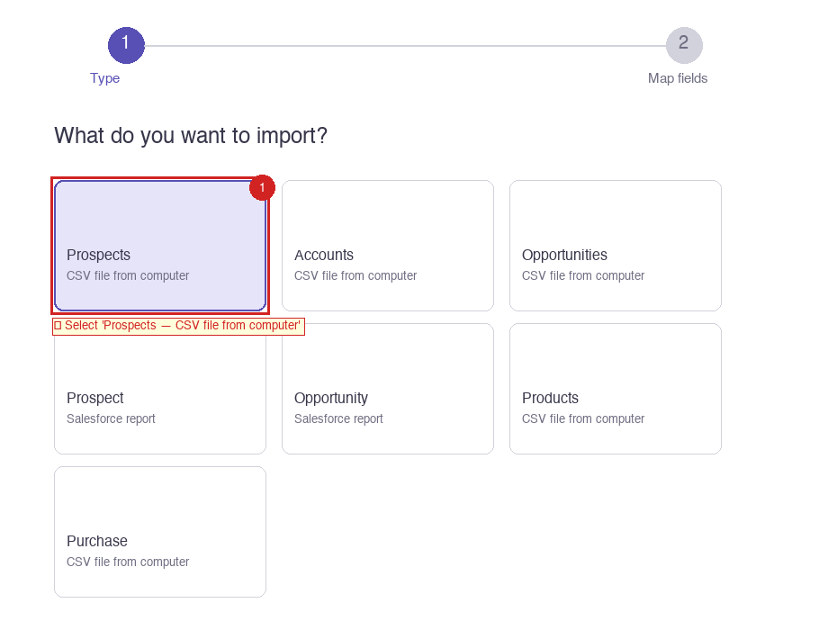
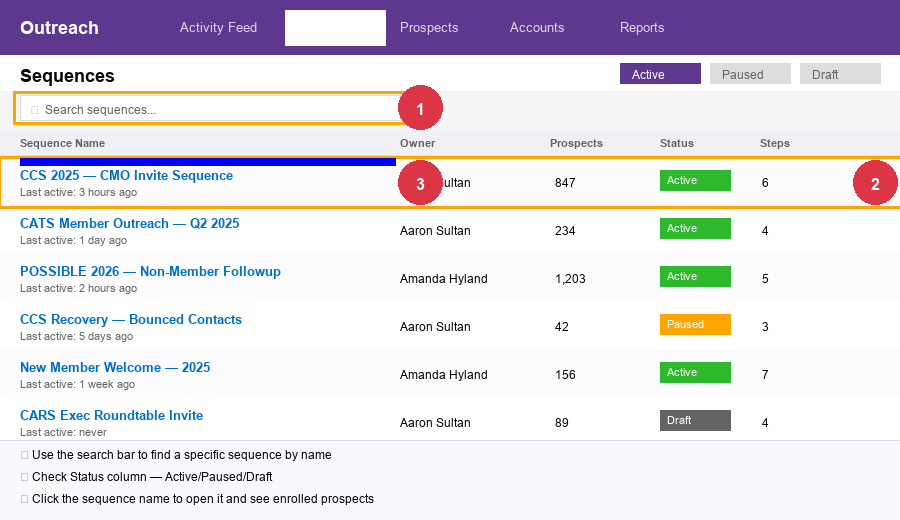
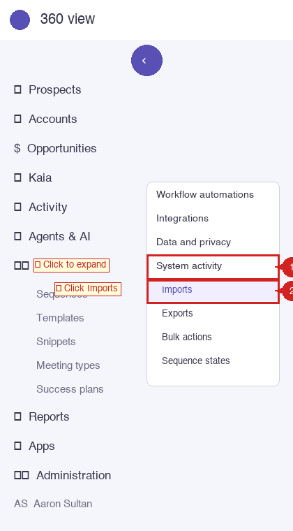
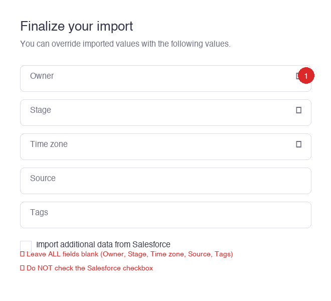
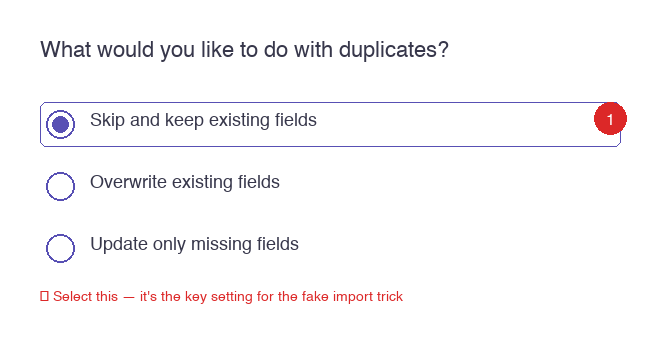
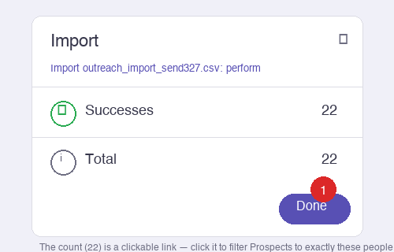
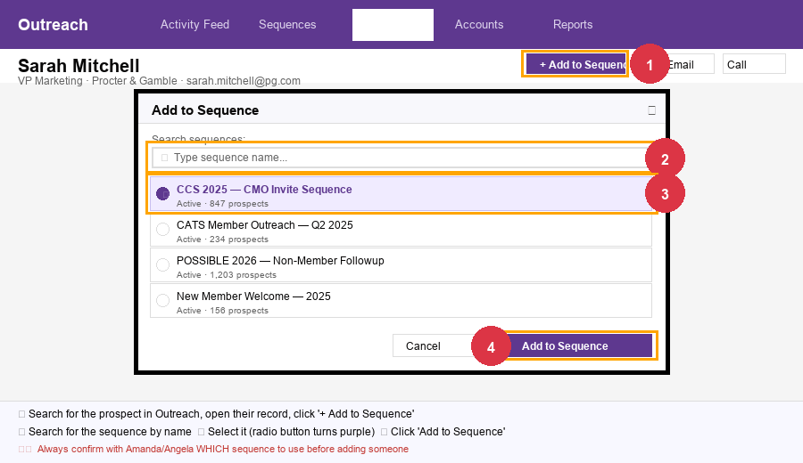

# Outreach — Sequences

**Outreach** is MMA's email outreach platform. It's used to send sequences (a series of timed emails) to groups of contacts — primarily for event invitations and member outreach.

**URL:** https://app.outreach.io
**Login:** Separate from Salesforce — use your MMA credentials

**Key people:**
- **Amanda Hyland** — drives most sequence sends; always check with her before activating or pausing
- **Angela Gray** — runs CCS/CATS CMO outreach sequences
- **Greg Stuart** — sends personal CMO emails through Outreach

---

## Key concepts

- A **sequence** is a series of emails sent automatically over time (e.g., an invite email on Day 1, a follow-up on Day 5)
- Each person in a sequence is a **prospect**
- Sequences can be **Active** (sending) or **Paused** (stopped)
- If someone **replies**, Outreach stops sending to them automatically
- If someone **bounces**, they get flagged — remove them from future sequences
- Aaron also stores **assistants (EAs)** in Outreach linked to their executives — searching for a CMO may show their EA too

---

## The full workflow: Salesforce → Outreach

This is the end-to-end process for building a new audience and getting emails out.

---

### Step 1 — Export the list from Salesforce

1. Go to Salesforce → **Reports** (left nav or top nav)
2. Find and run a report with the right audience (see [Salesforce — Find & Pull Data](../04-salesforce-data/README.md))
3. Make sure the report includes at minimum: **First Name**, **Last Name**, **Email**, **Title**, **Account Name**
4. Click **Export** at the top right → choose **Details Only** → **CSV**
5. Save the file to your desktop

---

### Step 2 — Import into Outreach

1. Log into Outreach → click your **profile icon** (bottom left) → **System activity** → **Imports**
2. Click **New Import** → select **Prospects — CSV file from computer** *(see screenshot above)*
3. Upload the file from your desktop → click **Next**
4. On the **Map Fields** screen, match each column:

| CSV column | → | Outreach field |
|---|---|---|
| First Name | → | First Name |
| Last Name | → | Last Name |
| Email | → | Email *(required)* |
| Title | → | Title |
| Account Name | → | Account Name |

5. Click **Next** → then **Import**

> After import, Outreach shows a summary: **created** (brand new records) vs. **updated** (people already in Outreach). Both counts are normal.

---

### Step 3 — Add the imported prospects to a sequence

1. In Outreach, click **Sequences** in the top nav
2. Search for the sequence by name (e.g., "CATS May 2026")
3. Click into the sequence → click **Add Prospects** (top right)
4. Search for the people by name, or use the import batch filter (see Fake Import trick below)
5. Select everyone → click **Add to Sequence**
6. **Check with Amanda or Angela before activating** — they'll confirm the timing and list

---

### Step 4 — Activate (if the sequence is paused)

1. Inside the sequence, look at the top right
2. If it says **Paused** → click **Activate**
3. Always confirm with Amanda first — she manages send timing

---

## The "fake import" trick — target people already in Outreach

**When to use this:** You have a Salesforce export and you want to add those people to a sequence — but you don't want to overwrite any of their existing Outreach data, and you only want to work with the ones who are *already in Outreach*.

**How it works:** You import the CSV with a special setting that skips all updates. Outreach still processes the file and matches the records. It then shows you a **clickable count** of how many matched — clicking it filters the Prospects view to exactly those people. From there you can add them all to a sequence at once.

---

**Step-by-step:**

**1.** Export your list from Salesforce as a CSV (First Name, Last Name, Email minimum).

**2.** In Outreach, click your **profile icon** (bottom left) → **System activity** → **Imports** *(see screenshot above)*

**3.** Click **New Import** → select **Prospects — CSV file from computer** → upload your CSV

**4.** Work through the **Map Fields** step as usual: First Name, Last Name, Email, Title, Account Name

**5.** On the "Finalize your import" screen: Owner, Stage, Time zone, Source, Tags
   - **Leave every field blank** — do not assign an Owner, do not set a Time zone
   - You can optionally add a **Tag** (e.g., "CATS May batch") to label this group

**6.** Scroll down on that same screen → **"What would you like to do with duplicates?"**

   → Select **"Skip and keep existing fields"** *(see screenshot above)*

   > **This is the whole trick.** Outreach still processes the import and matches every person in your CSV to existing records — but because you chose "Skip," it makes zero changes to anyone's data. The magic is that every import creates a filter in Outreach. You're not really importing to update anything — you're importing to get that filter, so you can click the count and see exactly those people in the Prospects view.

**7.** Click **Import**. When it finishes, a popup shows **Successes** and **Total** → click **Done**

**8.** Back on the Imports list, find your completed import. The count (e.g., **22 of 22**) is a **clickable link** *(see screenshot above)*

**9.** Click that number → Outreach opens the Prospects page filtered to exactly those people

**10.** Check all the boxes → select all → click **Add to Sequence** → choose the sequence → confirm

---

## Tasks

### 🟢 EASY: Check a sequence's status and stats

1. In Outreach, click **Sequences** in the top nav
2. You'll see all sequences with their **Status** (Active / Paused / Draft), owner, and prospect count
3. Click into any sequence to see open rates, reply rates, and bounce rates

---

### 🟢 EASY: Check if a specific person is in a sequence

1. Go to Outreach → **Prospects** in the top nav
2. Search by name or email in the search bar
3. Click their record → scroll to the **Sequences** tab
4. You'll see every sequence they're in and their current status (Active, Finished, Bounced, etc.)

---

### 🟢 EASY: Pause a sequence (emergency stop)

1. In Outreach → **Sequences** → click into the sequence
2. Click **Pause** (top right)
3. Confirm — all scheduled emails stop immediately

> **When to do this:** There's a typo in an email, a board member got enrolled by mistake, or Amanda/Angela asks you to stop.

---

### 🟡 MEDIUM: Add one person to an existing sequence

1. In Outreach, find the person under **Prospects** → open their record
2. Click **+ Add to Sequence** (top right of their record)
3. Search for the sequence by name
4. Select it (radio button turns purple) → click **Add to Sequence**

> Always confirm with Amanda or Angela which sequence to use before adding someone.

If the person doesn't exist in Outreach yet:
- Go to **Prospects** → **+ New Prospect** (top right)
- Fill in: First Name, Last Name, Email, Title, Company
- Save — then follow the steps above

---

### 🟡 MEDIUM: Remove someone from a sequence (they replied or asked to stop)

1. Go to **Prospects** → search for the person → open their record
2. Click the **Sequences** tab
3. Find the active sequence → click **Finish** or **Remove**
4. All further emails in that sequence stop for them

---

## ⚠️ Things to never do in Outreach

- **Don't resume a paused sequence** without checking with Amanda or Angela first
- **Don't add board member contacts to sequences** — they're managed separately by Jade/Angela
- **Don't delete sequence steps** — it breaks the sequence permanently for everyone in it
