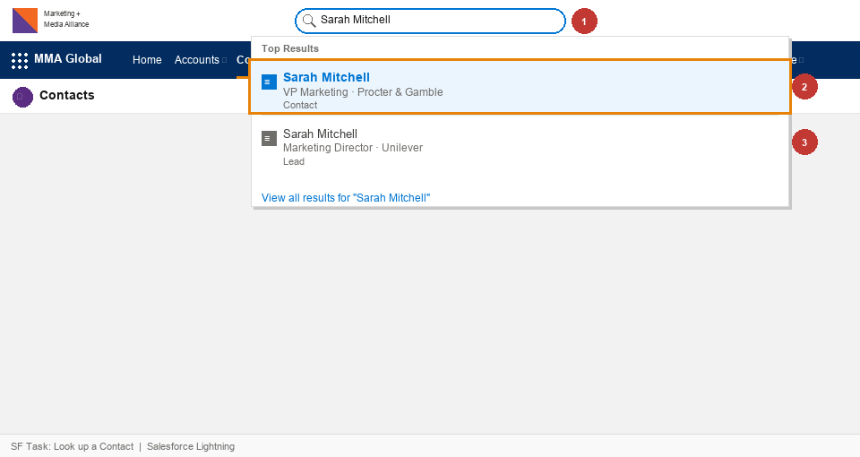
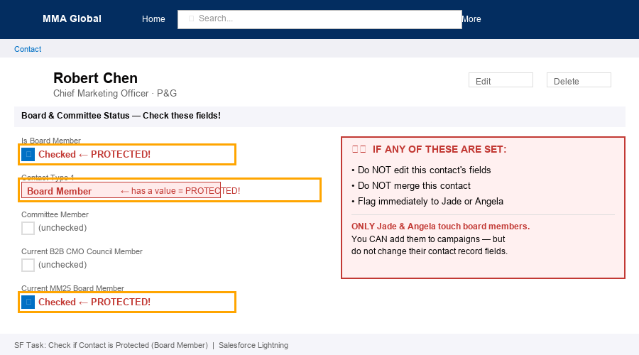
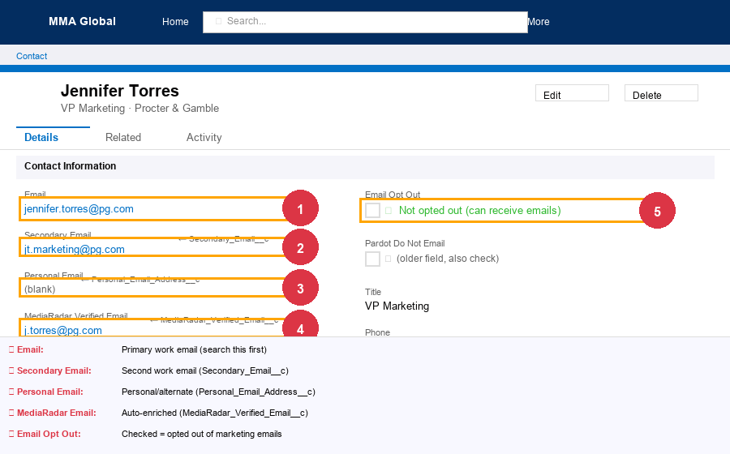
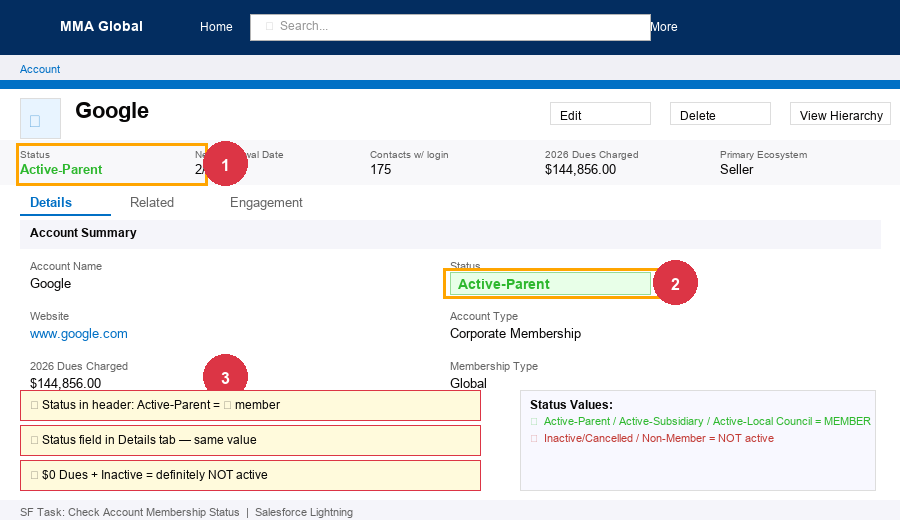
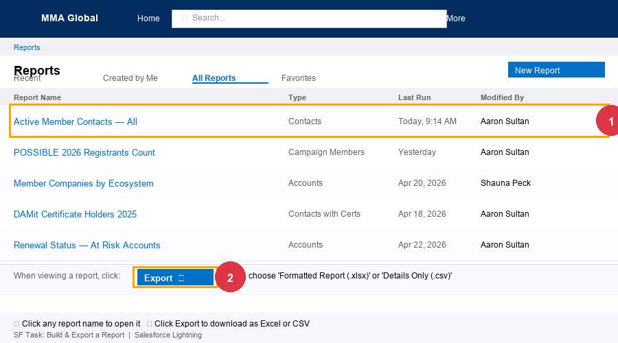

# Salesforce — Find & Pull Data

Salesforce is MMA's CRM. This section covers the most common lookups and data pulls you'll need.

**URL:** https://mmaglobal.lightning.force.com
**Login:** Your MMA email + Salesforce password

---

## Key concepts

- **Account** = a company (e.g., Procter & Gamble)
- **Contact** = a person at that company
- **Campaign** = a list of contacts associated with an event, email, or program (e.g., "CATS May 2026 - Registrants")
- **Account Status values:** `Active-Parent`, `Active-Subsidiary`, `Active-Local Council` = current member; `Inactive`, `Cancelled`, `Non-Member` = not a member
- **Protected contacts** = board members, B2B CMO Council, MFC — never edit their contact records; only Jade, Angela, and Shauna touch these

---

## Tasks

### 🟢 EASY: Look up a contact

1. Click the **search bar** at the top of any Salesforce page
2. Type the person's name or email address
3. Salesforce will show matching Contacts and Leads
4. Click the Contact record to open it

> **Can't find them?** Try searching just the last name, or search by email. Also check whether they might be a **Lead** (not yet converted to a Contact).

---

### 🟢 EASY: Check if a contact is a board member / protected

1. Open their Contact record
2. Look for any of these fields being checked:
   - `Is Board Member` = checked
   - `Current B2B CMO Council Member` = checked
   - `Current MM25 Board Member` = checked
   - `Committee Member` = checked
3. If any of these are set → **do not edit the contact record.** Flag to Jade or Angela.

---

### 🟢 EASY: Check a contact's email opt-out status

1. Open the Contact record
2. Look for **Email Opt Out** — if checked, they've opted out of marketing emails
3. Also check **Pardot Do Not Email** — an older field that means the same thing

> Opted-out people may still be reachable through Reach Marketing's sending domain — ask Amanda if this comes up.

---

### 🟢 EASY: Check all 4 email fields on a contact

Salesforce stores up to 4 emails per contact. If you can't find someone by email, check all four:

1. **Email** — primary email
2. **Secondary Email** (`Secondary_Email__c`) — second work email
3. **Personal Email** (`Personal_Email_Address__c`) — personal/alternate
4. **MediaRadar Verified Email** (`MediaRadar_Verified_Email__c`) — auto-enriched

---

### 🟢 EASY: Check a company's membership status

1. Search the company name in Salesforce
2. Open the **Account** record
3. Check the **Status** field:
   - `Active-Parent`, `Active-Subsidiary`, or `Active-Local Council` = ✅ current member
   - `Inactive`, `Cancelled`, or `Non-Member` = ❌ not active
4. Also check **X2026 Dues Charged** — if it shows $0 and status is Inactive, they're definitely not active

---

### 🟡 MEDIUM: Build a report or run a list view

**Option A — Use an existing report (fastest)**
1. Go to **Reports** in the top nav
2. Use the search bar to look for a report by name — someone may have already built what you need
3. Click the report → **Run** → review results
4. To export: click **Export** → choose **Excel** or **CSV (Details Only)**

**Option B — Build a new report**
1. Go to **Reports** → click **New Report**
2. Select a report type (e.g., "Contacts," "Contacts with Campaign Members," "Accounts")
3. Add filters — e.g., Account Status = Active-Parent, Region = NA
4. Add the columns you need (e.g., Name, Email, Title, Account Name)
5. Click **Run** to preview
6. Click **Save** to name it, then **Export** if you need a file

> **Tip:** Always search for existing reports before building new ones. There are a lot of pre-built reports already in there.

---

### 🟡 MEDIUM: Pull a campaign member list

Campaigns in Salesforce track who was invited, registered, or attended an event or program.

1. Go to **Campaigns** in the top nav (or search the campaign name in the search bar)
2. Open the campaign record
3. Scroll down to **Campaign Members** related list
4. You can see everyone in the campaign and their **Status** (Invited, Registered, Attended, etc.)
5. To export: click the **dropdown arrow** next to "Campaign Members" → **Export to CSV** (or run a Campaign Members report)

> To find the right campaign, search by event name and year — e.g., "CATS May 2026."

---

### 🟡 MEDIUM: Update a contact's title (only if blank)

1. Open the Contact record
2. Click the **pencil/edit icon** next to the Title field (inline edit)
3. Type the correct title
4. Click **Save**

> Only do this if the Title field is completely blank. Don't overwrite an existing title — even if it looks outdated, flag it instead.

---

### 🟡 MEDIUM: Add a contact to a Salesforce campaign manually

1. Go to the Contact record
2. Scroll down to the **Campaign History** related list
3. Click **Add to Campaign**
4. Search for the campaign name → select it
5. Choose the correct **Status** (usually "Invited" or "Registered")
6. Save

> For adding more than a handful of people at once, it's faster to run a report and use the **Campaign** → **Manage Members** import — but for 1–5 people, this method works fine.

---

### 🟡 MEDIUM: Check if someone is already in a campaign

1. Open their Contact record
2. Scroll to **Campaign History** related list
3. You'll see every campaign they've ever been added to, with their status in each

---

## ⚠️ Things to never do in Salesforce

- **Never delete records** — deactivate or flag to Aaron/Angela instead
- **Never merge board member records** — only Jade does this
- **Never remove the Account from a Contact** — every contact must have an account
- **Never modify Account Status** — that's Shauna's job
- **Never create a new Account** — if you can't find a company in Salesforce, flag it; don't create one
