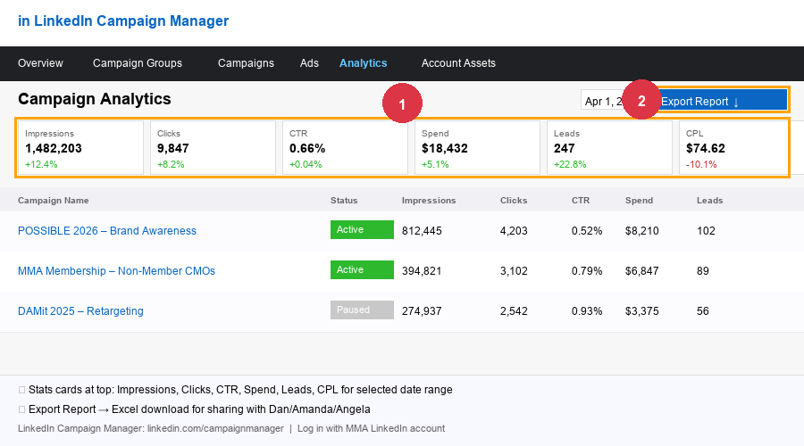

# Analytics & Reporting

Aaron pulls data from multiple analytics platforms to answer questions about campaign performance, member engagement, and registration numbers.

---

## Tasks

### 🟢 EASY: Export a Salesforce report to Excel/CSV

1. Go to **Reports** in Salesforce
2. Find the report you need (use the search bar)
3. Click **Run**
4. Click the **Export** button (top right) → choose Excel or CSV format
5. The file downloads to your computer

> **Common reports Aaron uses:**
> - "POSSIBLE 2026 Registrants – Members" — registration status by member company
> - "Active NA/Global Member Contacts" — full mailable contact list
> - "CCS Campaign Members" — CMO Summit invitation tracker

---

### 🟢 EASY: Check POSSIBLE registration numbers

1. In SF, search for the campaign `POSSIBLE 2026_registration`
2. Open the Campaign record
3. The **Campaign Statistics** panel shows:
   - Total Members
   - Responses (Registered vs. Invited)
4. For a breakdown by company, click **View Campaign Members**

---

### 🟢 EASY: Pull LinkedIn campaign performance numbers

**When this comes up:** Amanda or Dan asks for LinkedIn ad stats.

1. Go to **LinkedIn Campaign Manager**: https://www.linkedin.com/campaignmanager
2. Select the **MMA** account
3. Click **Analyze** → **Reporting**
4. Select the campaign and date range
5. Key metrics to look for: Impressions, Clicks, Click-through rate (CTR), Cost per click (CPC)
6. Export to CSV if needed: click **Export** at the top right

> **Note:** There is sometimes a discrepancy between LinkedIn's reported numbers and Google Analytics (GA). LinkedIn tends to report more conversions than GA shows. This is a known tracking issue — always note which platform the numbers are from.

---

### 🟡 MEDIUM: Pull GA (Google Analytics) data for a campaign

1. Go to **Google Analytics**: https://analytics.google.com
2. Select the **MMA Global** property
3. Go to **Reports** → **Acquisition** → **Traffic Acquisition**
4. Set the date range (top right)
5. To find LinkedIn campaign traffic specifically, look for `medium = cpc` or `source = linkedin`
6. Export with the **Share** → **Download** button

> **If you need to filter by UTM parameters** (campaign tags in URLs): go to **Explore** → create a **Free Form** exploration and add dimensions for `Campaign`, `Source`, `Medium`.

---

### 🟡 MEDIUM: Pull the POSSIBLE registration report for leadership

Amanda or Angela may ask for a summary of registration by member company.

1. Export the POSSIBLE 2026_registration Campaign Members from SF (see Easy task above)
2. Open in Excel
3. Create a pivot table:
   - Rows = Account Name
   - Values = Count of Contacts
   - Filter = Status = Registered
4. Sort descending by count

This gives a company-by-company view of who has registered.

---

### 🔴 HARD: AI Newsletter (Rasa) engagement sync

Aaron runs `sync_rasa_ai_newsletter.py` to sync newsletter open/click data from Rasa to contact-level SF fields. This runs nightly and should be set up as a cron job. If the sync hasn't run, contact Aaron or ask IT. Do not attempt manually.

---

### 🔴 HARD: Kargo campaign analysis

Aaron runs `update_kargo_report.py` to process Kargo's media delivery data and produce a formatted Excel report. For coverage, hold this for Aaron.

---

### 🔴 HARD: Engagement report (PDF/Word doc)

Aaron builds periodic engagement reports using Python. For coverage, ask Angela or Dan what they need — a simple SF report export may be sufficient.
